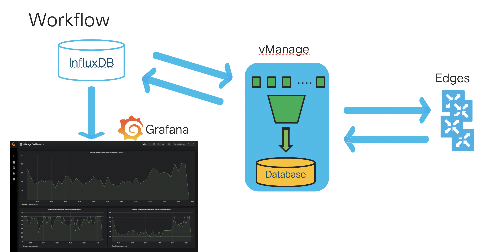

# DEVWKS 3484 (SD-WAN DevOps Step 4 - Monitoring and Analytics)

# Requirements

To use this code you will need:

* Python 3.7+

# Install and Setup

Clone the code to local machine.

```
git clone https://github.com/suchandanreddy/sdwan-devops-devwks-3484.git
cd sdwan-devops-devwks-3484
```

Create vpn_details file in below format

```
<POD-Name> <Anyconnect Client> <VPN Username> <Password>
```

Run Setup command to create docker container and initialise InfluxDB, Grafana as per requirements. 

```
./setup.sh vpn_details
```

# Use Case - 1

## Objective

- How to retrieve the Enterprise Firewall Inspect session counter values

- Store firewall inspect count values in a Time Series Database (TSDB) Influx DB

- Plot statistics on to Grafana Dashboard



# Use Case - 2

## Objective 

- Configure Webhook Notifications on vManage

- Spin up Webserver on Windows VM to process the webhook notifications data

- Trigger alert to WebEx Teams room based on the data recieved in Webhook Notification. 


