# Webhooks

-   Webhooks enable push-model mechanism to send notifications in real-time.
-   Polling for Alarms is expensive!
-   Webhooks are sometimes referred to as **Reverse APIs**
-   We need to design an API route to process the data sent via Webhook.

# vManage Configuration

Steps to enable webhook notifications to push alarm details to external systems.

**Step-1:**

- Select **Email Notifications** from **Monitor -> Alarms**


**Step-2:**

- Click on **Add Email Notification**


**Step-3:**

- Enter name of the webhook : <b>cleur-webhooks</b>
- Select severity level : <b>Critical</b>
- Select Alarm Name : <b>System Reboot Issued</b>

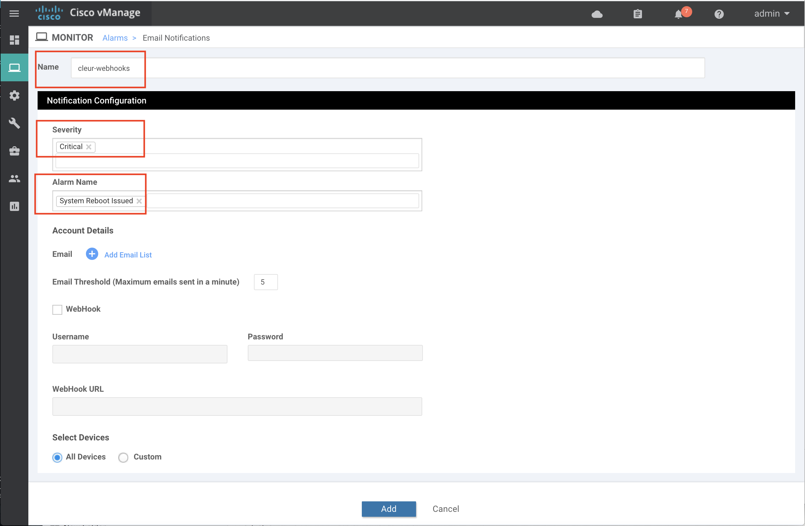

**Step-4:**

- Click on <b>Add Email list</b> and then <b>Add Email</b>
- Enter dummy email-id **test@test.com** , as we are using only webhooks in this workshop

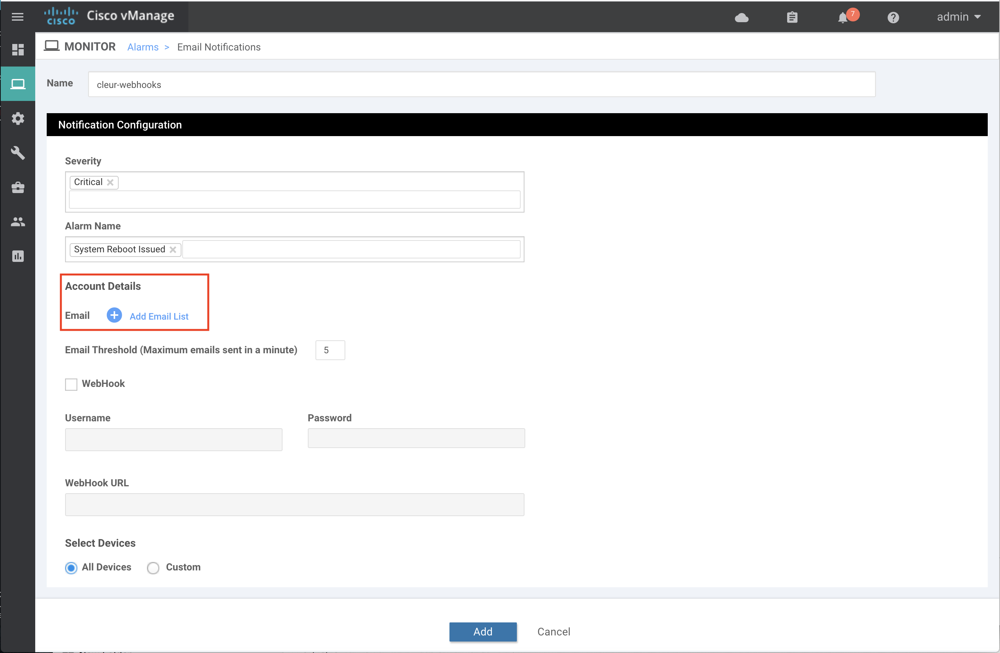

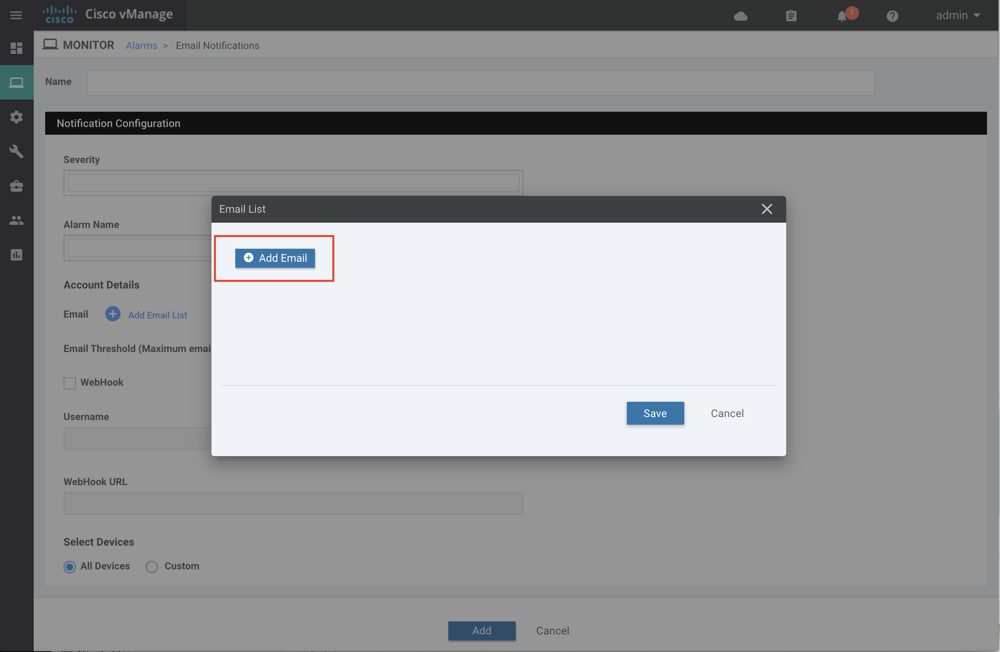

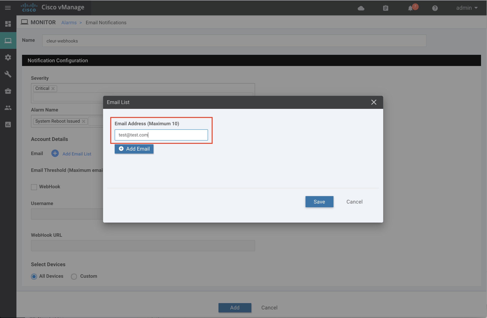

**Step-5:**

- Enable webhook checkbox.
- Provide the webhook server URL, username and password. 

- Webhook Server URL : http://198.18.133.36:5001/
- Username : **cleur**
- Password : **cleur**

- Select **All Devices** and click on **Add** to complete the webhook settings.


#	Notifications Dashboard 

List of Notifications rules configured can be seen in section **Alarms > Email Notifications**

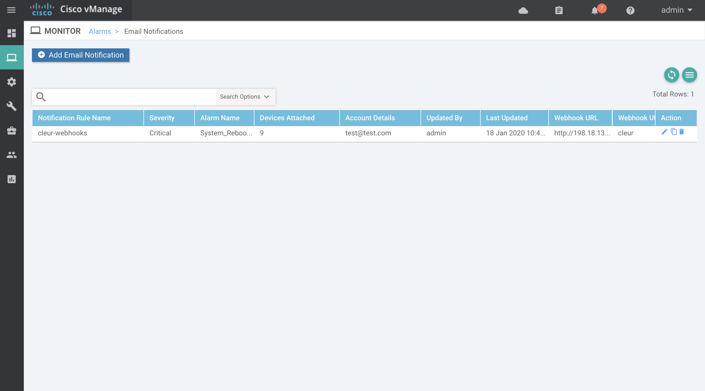

# Setup Webhook server on Windows VM

Now let’s try to setup webhook server on windows VM to accept notifications sent from vManage

- In order to accept HTTP post requests sent from vManage, we need to enable HTTP web server and design API route.
- Below code spins up flask web server listening on port 5001 for HTTP POST requests
- Defined alarms() function accepts the POST request at route http://server-ip:port/ and extracts the data from request, then it sends message
to Webex Teams Room. 

```
from flask import Flask, request, jsonify
from flask_basicauth import BasicAuth
from ciscosparkapi import CiscoSparkAPI, SparkApiError
import json
import os
import datetime
import pytz

bearer_token = os.environ.get("bearer_token")
room_id = os.environ.get("room_id")

if bearer_token is None or room_id is None:
    print("\nWebex Teams Authorization and roomId details must be set via environment variables using below commands on macOS or Ubuntu workstation")
    print("export bearer_token=<authorization bearer token>")
    print("export room_id=<webex teams room-id>")
    print("\nWebex Teams Authorization and roomId details must be set via environment variables using below commands on Windows workstation")
    print("set bearer_token=<authorization bearer token>")
    print("set room_id=<webex teams room-id>")
    exit()

app = Flask(__name__)

app.config['BASIC_AUTH_USERNAME'] = 'cleur'
app.config['BASIC_AUTH_PASSWORD'] = 'cleur'

basic_auth = BasicAuth(app)

@app.route('/',methods=['POST'])
@basic_auth.required
def alarms():
   try:
      data = json.loads(request.data)
      print(data)
      CET = pytz.timezone('Europe/Madrid')
      
      message =  'Team, **Alarm Event** : ' + data['rule_name_display'] + ', **Message** : ' + data['message'] + ', is recieved from vManage and here are the complete details<br>'
      
      temp_time = datetime.datetime.utcfromtimestamp(data['receive_time']/1000.)
      temp_time = pytz.UTC.localize(temp_time)

      message = message + '**Receive Time:** ' + temp_time.astimezone(CET).strftime('%c') + ' CET'

      temp = data['values_short_display']

      for item in temp:
          for key, value in item.items():
              message = message + '<br> **' + key + ':** ' + value

      api = CiscoSparkAPI(access_token=bearer_token)
      res=api.messages.create(roomId=room_id, markdown=message)
      print(res)
      
   except Exception as exc:
      print(exc)
      return jsonify(str(exc)), 500
   
   return jsonify("Message sent to Webex Teams"), 200

if __name__ == '__main__':
   app.run(host='0.0.0.0', port=5001, debug=True)
```

**Step-1:**

- Launch **Command Prompt** from Windows VM Desktop using below shortcut


**Step-2:**

- Run command **cd Desktop** and **python webhook.py** to start the webserver.

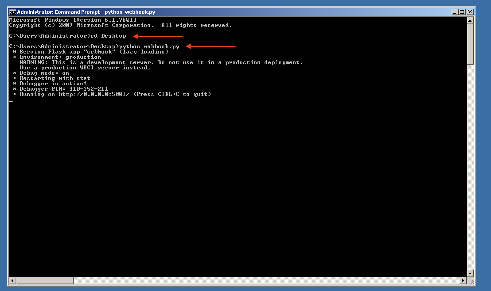

**Step-3:**

- Lauch **MTPuTTY** from Windows VM Desktop using below shortcut

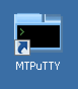

**Step-4:**

- Select **DC1-VEDGE1** router from side tab on MTPuTTY
- Login password for DC1-VEDGE1 is **admin**
- Run command **reboot now** on DC1-VEDGE1 router SSH session to trigger 
webhook notification

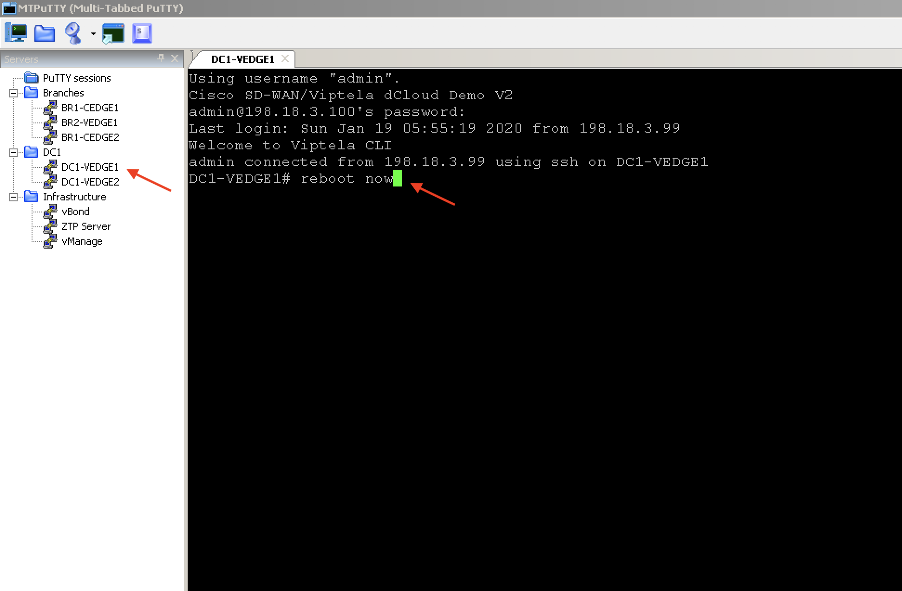

## Logs from Webhook Server

Sample JSON output on webhook server on receiving notifications from vManage.

<pre>
{
     u'entry_time':  1579323422000L,
     u'severity':  u'Critical',
     u'rule_name_display':  u'System_Reboot_Issued',
     u'severity_number':  1,
     u'component':  u'System',
     u'values_short_display':  [
        {
             u'host-name':  u'DC1-VEDGE1',
             u'system-ip':  u'10.1.0.1'
        }
    ],
     u'devices':  [
        {
            u'system-ip':  u'10.1.0.1'
        }
    ],
     u'eventname':  u'system-reboot-issued',
     u'receive_time':  1579323421121L,
     u'statcycletime':  1579323422000L,
     u'values':  [
        {
             u'host-name':  u'DC1-VEDGE1',
             u'reboot-reason':  u'Initiated by user',
             u'system-ip':  u'10.1.0.1'
        }
    ],
     u'rulename':  u'system-reboot-issued',
     u'active':  True,
     u'message':  u'The device rebooted',
     u'type':  u'system-reboot-issued',
     u'acknowledged':  False,
     u'uuid':  u'226bd188-35e8-450f-b40b-b0c5f279f562'
}
</pre>

# Alarms on vManage

-	Above webhook log corresponds to this system reboot alarm that was received by vManage.

<br>

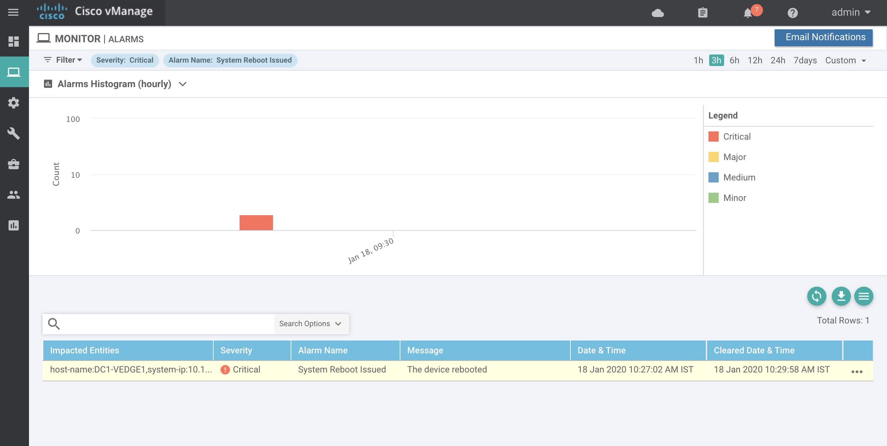

<br>

# Alert on Webex Teams Space

- The script on Windows VM extracts the webhook notification and sends the message to provided Webex Teams Room. Here is the sample output. 

<br>

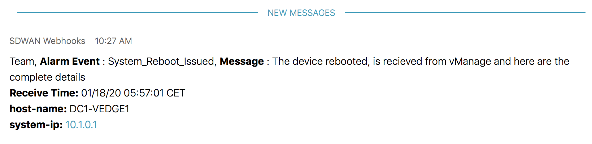

<br>

# Reference

<b>This setting is enabled in our lab setup during initialisation</b>

- Enable **Email Notifications** option in Administration settings of vManage.

(**Note:** Email notifications should be enabled in order to use either Email notifications or Webhooks)

- For using only Webhooks, please provide dummy values, e.g., Select Security option **None** and enter SMTP Server as **test.mail.com**

- Enter dummy values for **From address** and **Reply to address** as **test@test.com**

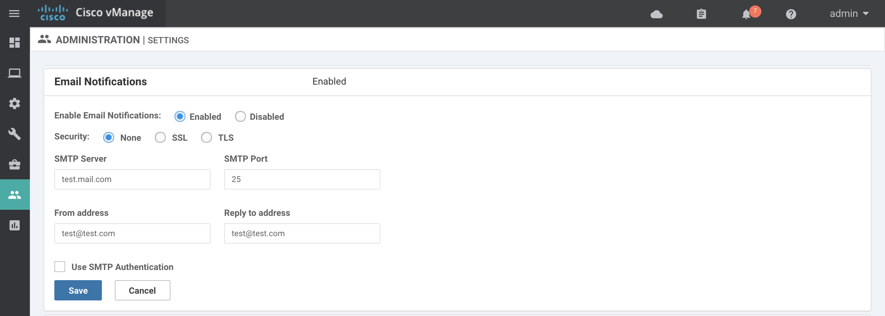

